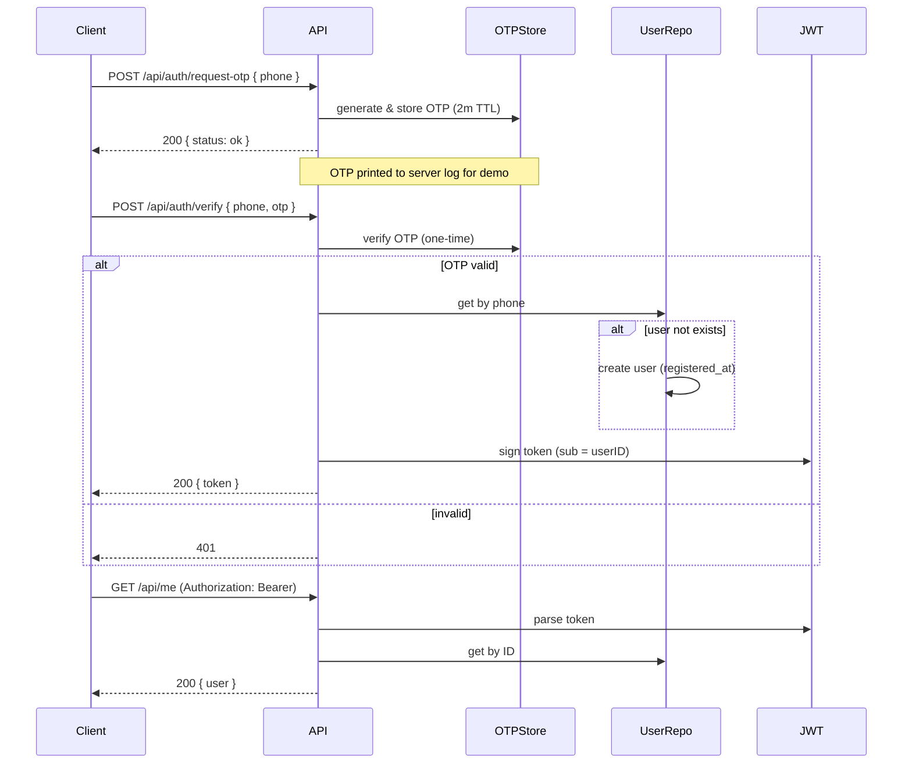

# OTP Auth Service

[](https://golang.org)  

> **otp-auth-api** — a compact, production-minded Go service that implements OTP-based login/registration, lightweight user management, JWT authentication, rate-limiting and OpenAPI documentation. Designed to be easy to run for reviewers while following real-world patterns.

---

## Features

- **OTP login/registration**
  - `POST /api/auth/request-otp`: generate a 6-digit OTP (printed to server logs), valid for **2 minutes**.
  - `POST /api/auth/verify`: validate OTP; if user not exists → register, else login. Returns **JWT**.
- **Rate limiting**: max **3 OTP requests per phone** per **10 minutes**.
- **User management** (JWT protected):
  - `GET /api/me`
  - `GET /api/users/{id}`
  - `GET /api/users?search=&page=&page_size=` (pagination + search by phone substring)
- **Storage choice**: In-memory for simplicity and speed in take-home tasks. No external DB required.

## Why In-Memory?

In-memory storage keeps the code and architecture clear while meeting all requirements. It removes infra complexity (migrations, credentials), speeds up evaluation, and still demonstrates proper layering (handlers → services → repositories). If a DB is required later, the repository interfaces make it straightforward to swap implementations.


## Architecture & rationale

The codebase follows a simple, testable layering:

- `internal/handlers` — HTTP routing & request/response handling
- `internal/service` — application rules (OTP lifecycle, rate limiting, JWT issuance)
- `internal/repo` — storage abstractions (in-memory by default)
- `internal/token` — JWT signing & parsing
- `cmd/server` — composition root (wires dependencies)

This separation keeps responsibilities small and makes it trivial to swap the storage implementation for a real DB.

---

## Data model

```json
{
  "id": "uuid",
  "phone": "+989123456789",
  "registered_at": "2025-09-06T12:34:56Z"
}
```

---



---

## Quickstart

### Run locally

```bash
make up
make migration-up
go run cmd/server/main.go
```

The API listens on `http://localhost:8080`.


### Run with Docker


```bash
make up
```

- API: `http://localhost:8080`

---